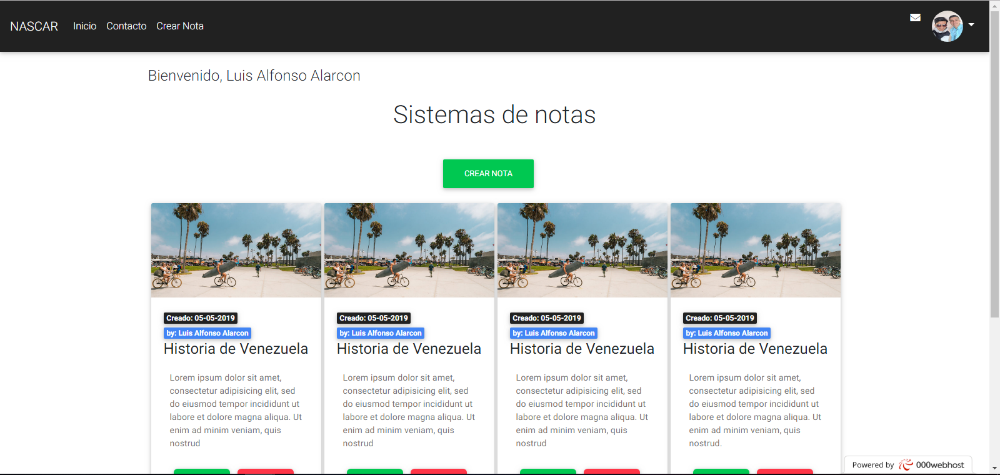
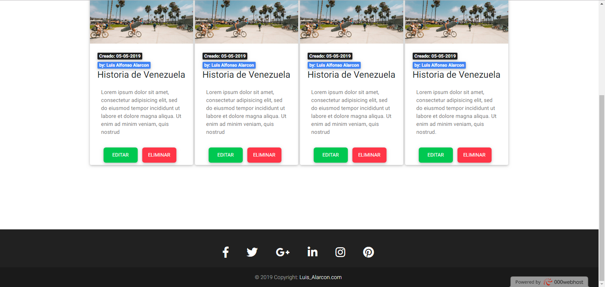
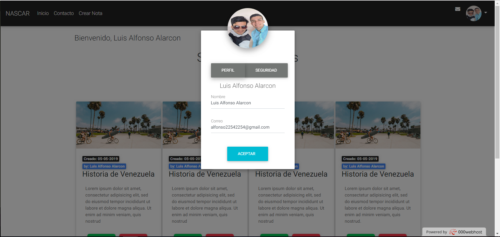
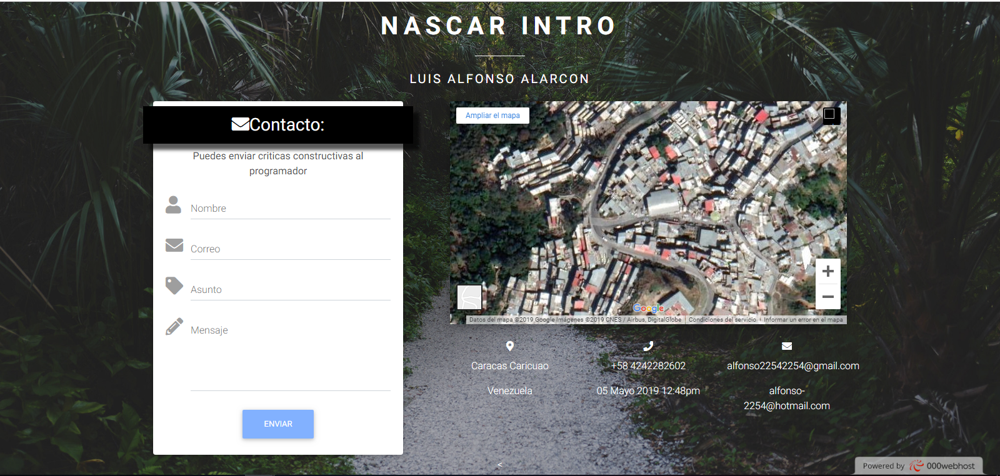
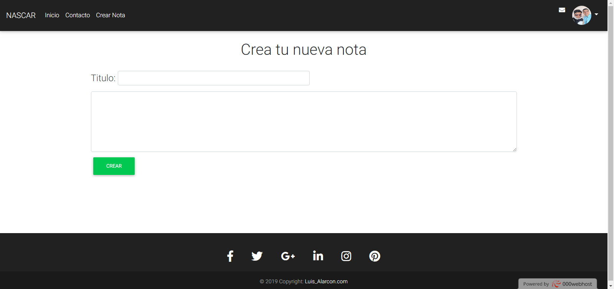
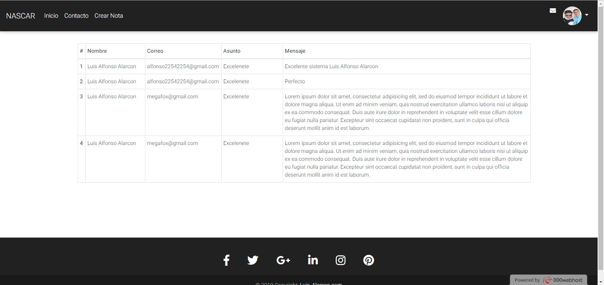

# Proyecto NASCAR

El Proyecto Nascar fue diseñado y construido desde cero por el programador Luis Alfonso Alarcon. Con la intención de aportar para la comunidad de IUTA - Informática. En el podrás registrarte, con la técnica CRUD para almacenar las notas de cada usuario. By: Alarcon...

# Screenshots

